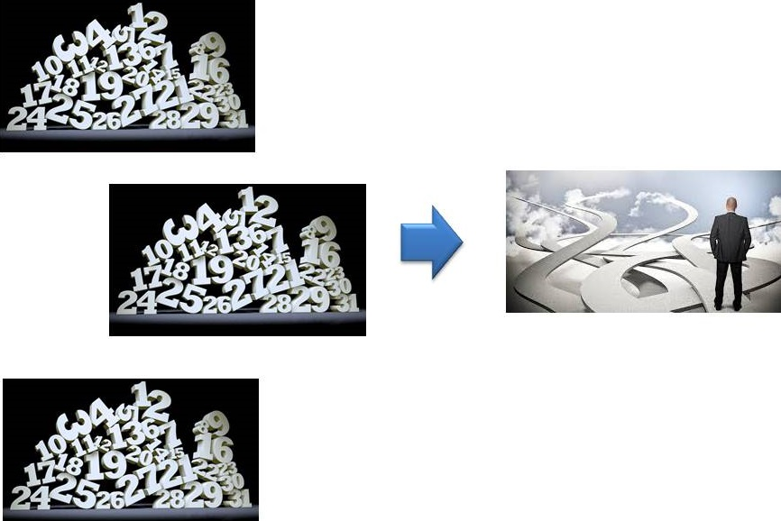

```{r setup, include=FALSE}
options(htmltools.dir.version = FALSE)
knitr::opts_chunk$set(echo = FALSE, 
                      comment = '',
                      message = FALSE,
                      warning = FALSE,
                      cache = TRUE)
```
<style> 
#caixa {
  border: 1px solid;
  padding: 10px;
  box-shadow: 5px 10px blue;
}
div {
  text-align: justify;
  text-justify: inter-word;
}
</style>

# Formação &#127891;

&#10004; Ensino básico

<br>

&#127979; EMEIF Álvares Machado

<br>

--

&#127979; EE Profa. Angélica de Oliveira

---

&#10004; Bacharel em Estatística

```{r , echo=FALSE, fig.align = 'center', out.width = '35%'}
knitr::include_graphics('figuras/fct.jpg')
```

<br>

--

&#10004; Mestrado e Doutorado em Ciências

```{r , echo=FALSE, fig.align = 'center', out.width = '45%'}
knitr::include_graphics('figuras/esalq.jpg')
```

---

# Universidades &#127979;

&#10004; Unoeste

```{r , echo=FALSE, fig.align = 'center', out.width = '25%'}

```

<br>

&#10004; UEM

```{r , echo=FALSE, fig.align = 'center', out.width = '25%'}
knitr::include_graphics('figuras/logo_uem.jpg')
```

<br>

&#10004; UTFPR

```{r , echo=FALSE, fig.align = 'center', out.width = '25%'}
knitr::include_graphics('figuras/utfpr.jpg')
```

---

# Apresentar-se

- Nome

<br>

- Período

<br>
- Curso

```{r , echo=FALSE, fig.align = 'right', out.width = '60%'}
knitr::include_graphics('https://media.giphy.com/media/TKNGghpLhaz9XH1tSj/giphy.gif')
```

---

# Importância da Estatística para Engenharia de Produção &#129327;

As Unidades Curriculares a seguir tem a **Estatística** com pré-requisito

&#10004; **Ciências de Dados**

--

<br>

&#10004; **Controle Estatístico da Qualidade**

--

<br>

&#10004; **Gestão da Manutenção**

--

<br>

&#10004; **Simulação de Sistemas Discretos**

---

# Objetivo da disciplina &#127919;

<div id="caixa">
 <div>Desenvolver uma compreensão sólida em <font color="#0066cc">Estatística</font> para aplicação nas Unidades Curriculares: <font color="#0066cc">Ciências de Dados, Controle Estatístico da Qualidade, Gestão da Manutenção e Simulação de Sistemas Discretos</font>. Visando fortalecer o raciocínio lógico, crítico e analítico necessários para interpretar situações cotidianas e estabelecer relações causais entre fenômenos.</div>
</div>

<br>

.pull-left[
Horário da Aula &#9200;
]
.pull-right[
- Segunda-feira das 20:20--22:00

- Terça-feira das 16:40--18:20

- **Tolerância**: 5 minutos
]

<br>

--

.pull-left[
Horário de Atendimento &#9200;
]
.pull-right[
- Segunda-feira das 10:20-11:10

- Terça-feira das 19:10-20:50
]

---

# Conteúdo Programático &#128214;

&#10004; Conceitos básicos de estatística descritiva

```{r , echo=FALSE, fig.align = 'center', out.width = '40%'}
knitr::include_graphics('figuras/fig2.jpg')
```

<br>

--

&#10004; Conceitos básicos de probabilidade

```{r , echo=FALSE, fig.align = 'center', out.width = '40%'}

```

---

&#10004; Conceitos básicos Variável aleatória e modelos de distribuição de probabilidade.

```{r , echo=FALSE, fig.align = 'center', out.width = '50%'}
knitr::include_graphics('figuras/fig4.jpg')
```

<br>

--

&#10004; Conceitos básicos de inferência estatística.

```{r , echo=FALSE, fig.align = 'center', out.width = '50%'}
knitr::include_graphics('figuras/fig5.jpg')
```

---

# Bibliografia básica &#128218;

&#10004; BUSSAB, Wilton de Oliveira; MORETTIN, Pedro Alberto. **Estatística básica**. 5ed. São Paulo: Saraiva, 2004. 526 p.

```{r , echo=FALSE, fig.align = 'center', out.width = '35%'}
knitr::include_graphics('figuras/fig8.jpg')
```

---

# Bibliografia básica &#128218;

&#10004; MONTGOMERY, Douglas C.; RUNGER, George C. **Estatística aplicada e probabilidade para engenheiros**. 4ed. Rio de Janeiro, RJ: LTC, 2009, 493 p.

```{r , echo=FALSE, fig.align = 'center', out.width = '35%'}
knitr::include_graphics('figuras/fig9.jpg')
```

---

# Bibliografia complementar &#128218;

- MORETTIN, L.G. **Estatística básica: probabilidade e inferência**, volume único. São Paulo: Pearson Prentice Hall, 2009. 375 p.

<br>

- SPIEGEL, M.R.; SCHILLER, J.J.; SRINIVASAN, R.A. **Teoria e problemas de probabilidade e estatística**. 2.ed. São Paulo: McGraw-Hill, 2004. 398 p.

<br>

- FONSECA, J.S.; MARTINS, G.A. **Curso de estatística**. 6.ed. São Paulo: Atlas, 1996. 320 p. 

---

# Lista de exercícios &#9997;

Haverá listas de exercícios para serem resolvidas em casa. Resolver os problemas da lista de exercícios é uma forma de aprendizagem, pois é uma maneira de colocar em prática tudo que você leu e ouviu, e vai lhe fornecer um *feedback* sobre o que foi abordado em sala de aula.

```{r , echo=FALSE, fig.align = 'center', out.width = '30%'}
knitr::include_graphics('https://media.giphy.com/media/1oBwBVLGoLteCP2kyD/giphy.gif')
```


&#10004; Vocês são **encorajados** a resolver problemas com os outros estudantes, compartilhar e discutir ideias.


&#10004; As respostas de cada problema devem ser **resultados de seu próprio esforço**.

---

# Complementação de carga horária

.pull-left[

&#10004; Elaboração de notas de aula.

&#10004; Atividades extraclasse.
]
.pull-right[

]

<br>

```{r , echo=FALSE, fig.align = 'right', out.width = '40%'}
knitr::include_graphics('https://media.giphy.com/media/xTiQywlOn0gKyz0l56/giphy.gif')
```


---

# 

&#10004; <https://moodle.utfpr.edu.br/login/index.php>

<br>

&#10004; Londrina - Graduação - Engenharia de Produção - 3o período

<br>

&#10004; Disciplina: 2025 - S2 - Probabilidade e Estatística

<br>

.pull-left[
&#10004; Senha: MAT013
]
.pull-right[
```{r , echo=FALSE, fig.align = 'left', out.width = '80%'}
knitr::include_graphics('https://media.giphy.com/media/IoP0PvbbSWGAM/giphy.gif')
```
]

<br>
