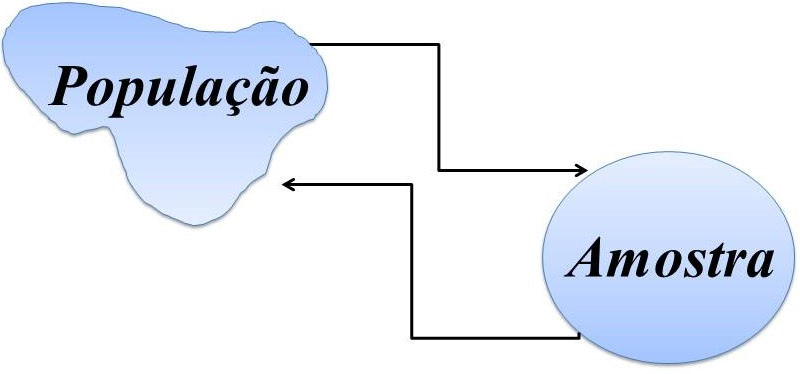

```{r setup, include=FALSE}
options(htmltools.dir.version = FALSE)
knitr::opts_chunk$set(echo = FALSE, 
                      comment = '',
                      message = FALSE,
                      warning = FALSE,
                      cache = TRUE)
```
<style> 
#caixa {
  border: 1px solid;
  padding: 10px;
  box-shadow: 5px 10px blue;
}
div {
  text-align: justify;
  text-justify: inter-word;
}
</style>

# Importância da Estatística para Engenharia de Produção &#129327;

As Unidades Curriculares a seguir tem a **Estatística** com pré-requisito

&#10004; **Ciências de Dados**

--

<br>

&#10004; **Controle Estatístico da Qualidade**

--

<br>

&#10004; **Gestão da Manutenção**

--

<br>

&#10004; **Simulação de Sistemas Discretos**

---

# Objetivo da disciplina &#127919;

<div id="caixa">
 <div>Desenvolver uma compreensão sólida em <font color="#0066cc">Estatística</font> para aplicação nas Unidades Curriculares: <font color="#0066cc">Ciências de Dados, Controle Estatístico da Qualidade, Gestão da Manutenção e Simulação de Sistemas Discretos</font>. Visando fortalecer o raciocínio lógico, crítico e analítico necessários para interpretar situações cotidianas e estabelecer relações causais entre fenômenos.</div>
</div>

<br>

.pull-left[
Horário da Aula &#9200;
]
.pull-right[
- Segunda-feira das 20:20--22:00

- Terça-feira das 16:40--18:20
]

<br>

--

.pull-left[
Horário de Atendimento &#9200;
]
.pull-right[
- Quarta-feira das 15:50-17:30

- Quinta-feira das 09:10-10:00
]

---

# Conteúdo Programático

&#10004; Conceitos básicos de estatística descritiva

```{r , echo=FALSE, fig.align = 'center', out.width = '40%'}
knitr::include_graphics('figuras/fig2.jpg')
```

<br>

--

&#10004; Conceitos básicos de probabilidade

```{r , echo=FALSE, fig.align = 'center', out.width = '40%'}
knitr::include_graphics('figuras/fig3.jpg')
```

---

&#10004; Conceitos básicos Variável aleatória e modelos de distribuição de probabilidade.

```{r , echo=FALSE, fig.align = 'center', out.width = '50%'}
knitr::include_graphics('figuras/fig4.jpg')
```

<br>

--

&#10004; Conceitos básicos de inferência estatística.

```{r , echo=FALSE, fig.align = 'center', out.width = '50%'}

```

---

# Bibliografia básica

&#10004; BUSSAB, Wilton de Oliveira; MORETTIN, Pedro Alberto. **Estatística básica**. 5ed. São Paulo: Saraiva, 2004. 526 p.

```{r , echo=FALSE, fig.align = 'center', out.width = '35%'}
knitr::include_graphics('figuras/fig8.jpg')
```

---

# Bibliografia básica

&#10004; MONTGOMERY, Douglas C.; RUNGER, George C. **Estatística aplicada e probabilidade para engenheiros**. 4ed. Rio de Janeiro, RJ: LTC, 2009, 493 p.

```{r , echo=FALSE, fig.align = 'center', out.width = '35%'}
knitr::include_graphics('figuras/fig9.jpg')
```

---

# Bibliografia complementar

- MORETTIN, L.G. **Estatística básica: probabilidade e inferência**, volume único. São Paulo: Pearson Prentice Hall, 2009. 375 p.

<br>

- SPIEGEL, M.R.; SCHILLER, J.J.; SRINIVASAN, R.A. **Teoria e problemas de probabilidade e estatística**. 2.ed. São Paulo: McGraw-Hill, 2004. 398 p.

<br>

- FONSECA, J.S.; MARTINS, G.A. **Curso de estatística**. 6.ed. São Paulo: Atlas, 1996. 320 p. 

---

# Aulas

&#10004; **Participar** da resolução dos exemplos, bem como do desenvolvimento de algum método quando for chamado.

```{r , echo=FALSE, fig.align = 'center', out.width = '30%'}

```


&#10004; **Questionar** quando tiver dúvidas.

---

# Lista de exercícios &#9997;

Haverá listas de exercícios para serem resolvidas em casa. Resolver os problemas da lista de exercícios é uma forma de aprendizagem, pois é uma maneira de colocar em prática tudo que você leu e ouviu, e vai lhe fornecer um *feedback* sobre o que foi abordado em sala de aula.

```{r , echo=FALSE, fig.align = 'center', out.width = '55%'}
knitr::include_graphics('figuras/fig10.jpg')
```

<br>

--

&#10004; Vocês são **encorajados** a resolver problemas com os outros estudantes, compartilhar e discutir ideias.

--

&#10004; As respostas de cada problema devem ser **resultados de seu próprio esforço**.

---

# Reposição de Aula

Em função do acompanhamento do grupo BAJA para competição a ser realizado em São José dos Campos - SP na durante 19/03 à 25/03, a seguintes aulas precisam ser repostas:

.pull-left[
&#10004; 19/03 - Terça-feira  --> 16/03 - sábado

&#10004; 25/03 - Segunda-feira --> 06/04 - sábado
]
.pull-right[

]

<br>

```{r , echo=FALSE, fig.align = 'right', out.width = '40%'}
knitr::include_graphics('https://media.giphy.com/media/xTiQywlOn0gKyz0l56/giphy.gif')
```

---

# Provas &#128221;

Haverá três avaliações que vão cobrir o conteúdo abordado em sala de aula, as listas de exercícios e as bibliografias citadas. As soluções de cada uma das provas devem estar bem **organizadas** e **justificadas**. Desta forma, você irá demonstrar sua capacidade de comunicar os seus resultados. Se a prova estiver **difícil de compreender** devido a organização e passagens não justificadas, haverá **penalidades**.

Qualquer conflito com as datas das provas devem ser comunicados na **segunda semana de aula**.

<br>

.pull-left[
<center>Prova 1</center>

Segunda-feira, **15/04**
]
.pull-right[
<center>Prova 2</center>

Segunda-feira, **20/05**
]

.pull-left[
<center>Prova 3</center>

Segunda-feira, **24/06**
]
.pull-right[
]

---

# Prova de segunda chamada 

No caso do aluno perder, **por motivo de doença ou força maior**, alguma avaliação, poderá solicitar, através de requerimento, uma única segunda chamada por avaliação, desde que no prazo determinado no Regulamento da Organização Didático-Pedagógica dos Cursos da UTFPR (Art.36 - Graduação e Art.31 - Técnico)

<br>

.pull-left[
<center>Prova de Segunda Chamada</center>

Segunda-feira, **25/06**
]
.pull-right[

]

<br>

Trabalho ou viagem a passeio **não são motivos** para segunda chamada.

---

# Cópia de provas (e/ou *internet*) e falsidade

```{r , echo=FALSE, fig.align = 'center', out.width = '40%'}
knitr::include_graphics('https://media.giphy.com/media/SRqTQmbYdm5jgS7xH9/giphy.gif
')
```

A desonestidade em nosso trabalho acadêmico representa uma **grave violação ética**.

<br>

Para maiores detalhes, consulte o **regulamento disciplinar do corpo discente da UTFPR**

<https://portal.utfpr.edu.br/documentos/graduacao-e-educacao-profissional/prograd/diretrizes-e-regulamentos/gestao/regulamento-disciplinar-do-corpo-discente/view>

---

# Não divulgar informações falsas!

```{r , echo=FALSE, fig.align = 'center', out.width = '50%'}
knitr::include_graphics('https://media.giphy.com/media/3orieNLnAxzZI9CQzm/giphy.gif?cid=ecf05e47gv1g9buos2wnbph6pwbmk45fp0luz268sanoyrru&rid=giphy.gif&ct=g')
```

**Faça questionamentos** sobre as informações a respeito dos tópicos da disciplina. 

**Relembre** o que foi passado em sala de aula.

---

# Critério de avaliação &#128220;

Resolução 122/10-COEPP/Artigo 4:

&#10004; Será aprovado o aluno que obtiver média final maior ou igual a 6 $(MF\geq6)$, em que
		$$MF=(P1+P2+P3)/3,$$
em que $Pi (i=1,2,3)$ é a $i$-ésima avaliação. Para MF poderá ser acrescentado um bônus por engajamento de no **máximo** 0,5 pontos a depender da decisão da turma.

<br>

&#10004; O aluno com $MF<6$ deverá fazer a prova de recuperação (**matéria toda**) no dia 02-07-2024, que substituirá a **menor nota** entre $P1$, $P2$ e $P3.$ Em seguida, a média final será recalculada $(MFr)$ considerando a nota da prova de recuperação. Então, a nota final será determinada pela expressão

$$NF=\min(6,MPr).$$
Será aprovado o aluno com $NF\geq6$.
